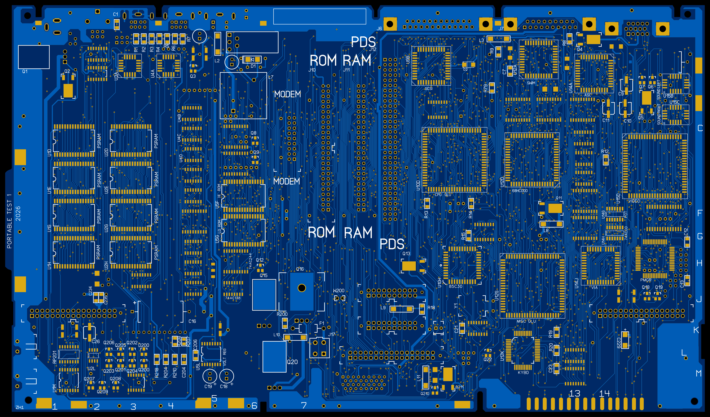

# Portable Logic Board

A full recreation of the logic board for the Model 5126 Backlit Macintosh Portable.

The board is currently a work in progress and is untested.

## Current Board File Notes

- Most of the silkscreen is missing.
- A cutout in the top of the board after the ADB port is missing.
- The axial capacitor in the top right is missing a through-hole pad.
- C16 has no net connection on the positive side, should be +5V.
- The right keyboard connector is missing a GND net on pin 1.
- Some ground planes are missing that were present on the original board.
- External floppy pin 1 is missing a GND net connection.

## Images

